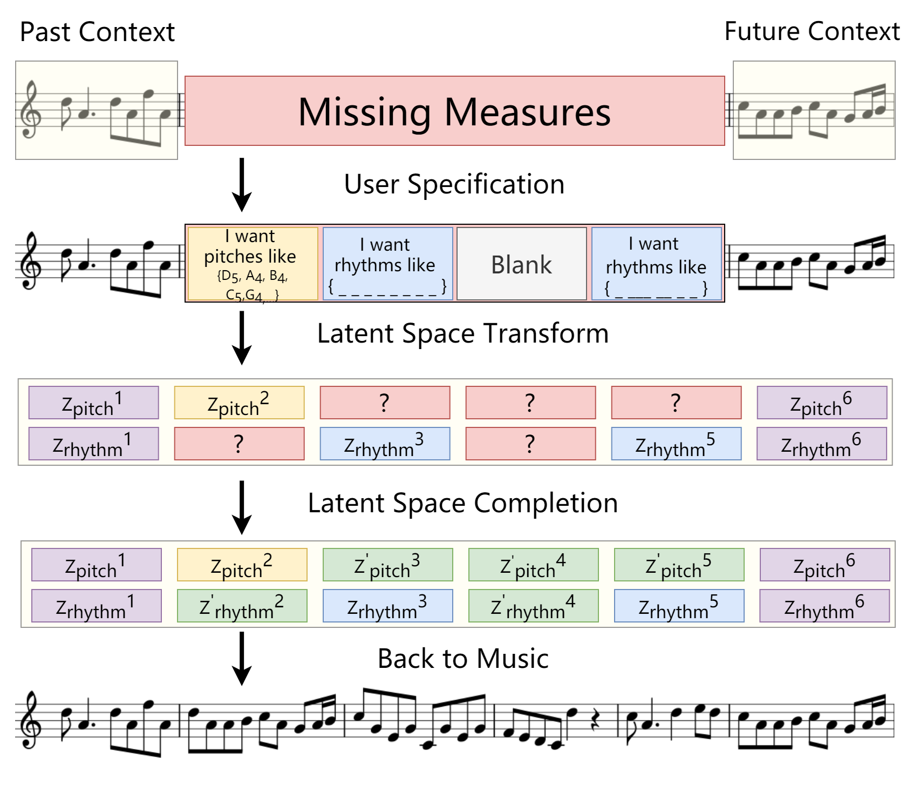
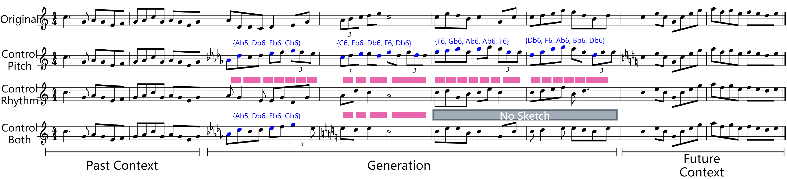

# Music-SketchNet Paper Repository 
Music SketchNet: Controllable Music Generation via Factorized Representations of Pitch and Rhythm, ISMIR 2020

## Intro
Music SketchNet allows you to specify your own music ideas, namely pitch contour and rhythm, in the monophonic music generation scenario.
It contains:
* SketchVAE converts the music meldoy tokens into the disentanglemd latent vector (z_pitch, z_rhythm)
* SketchInpainter receives the music latent vectors to predict the missing measure vector separately in rhythm and pitch space
* SketchConnector incorpoates a transformer encoder structure and random unmasking scheme in receiving the sketch control and finalizing the generation.

## Score Demo
Music SketchNet allows you to control the pitch, control the rhythm, or control both information in a music inpainting/completion scenario.

## Code Guidance
We provide a complete jupyter notebook tutorial/pipline to guide you into each step of the Music SketchNet:
* Data Processing
* VAE Models Constrution, Training, and Inference
* SketchNet Construction, Training, Inference, and Comarison with Other Models
* Experiments, including Model Metric Evaluation, VAE Independent Evaluation, Significance Test (in preparation), and Sketch Quantitaive Analysis

To run the code, you need to down the extra material data from this [link](https://drive.google.com/drive/folders/1xmg4ijhVJTse-V2BQ1hEBG2hQGYDQjTp?usp=sharing)
> data.zip: all processed data npy files, if you want to go through all process, you need to download it.

> IrishFolkSong.zip: if you only want to train and test three VAE structures (from 1-1 to 2-3), you only need to download this basic music midi data

> model_backup.zip: if you only want to skip most process and test the model, you can download the saved parameters for all models we trained.

#### Quick Start: 
> click the file [1-irish-process.ipynb](/1-irish-process.ipynb) follow from *1-irish-process.ipynb* to *5-2-vae_independent_test.ipynb*

In each folder, we provide the model python script, or the data loader. And it should be easily recognized by the folder name.
Below is the introduction of all jupyter notebook files:
* 1-irish-process.ipynb: process the irish folk song midi data for the later use in VAE trainings.
* 2-1-Train-EC2VAE.ipynb: train EC2-VAE.
* 2-2-MeasureVAE.ipynb: train MeasureVAE.
* 2-3-1-SketchVAE-data-process.ipynb: Split the data into the format for the  SketchVAE training.
* 2-3-2-SketchVAE-train.ipynb: train SketchVAE.
* 3-1-Index-process.ipynb: process the measure index for speeding up the data IO in the generative model training.
* 3-1-MusicInpaintNet.ipynb: train Music InpaintNet
* 3-2-SketchVAE_InpaintRNN.ipynb: train SketchVAE + InpaintRNN
* 3-3-SketchVAE_SketchInpainter.ipynb: train SketchInapinter (stage I training)
* 3-4-SketchNet.ipynb: train SketchNet (stage II training)
* 4-2-reptition-nonrepetition-dataset.ipynb: create sub-test set Irish-Test-R / NR
* 4-3-MusicInpaintNet-eval.ipynb: infer/output the generation from Music InpaintNet
* 4-4-SketchVAE-InpaintRNN-eval.ipynb: infer/output the generation from SketchVAE+InpaintRNN
* 4-5-SketchNet-eval.ipynb: infer/output the generation from SketchNet
* 5-1-loss_and_accuracy.ipynb: experiement concerned with the loss and the accuracy.
* 5-2-vae_independent_test.ipynb: Three VAE structures independent test 

## Credit
Please cite this paper if you want to use this work or base this work for the further project:
> @inproceedings{music-sketchnet,  
> &nbsp;&nbsp;&nbsp;&nbsp;&nbsp;&nbsp;&nbsp;&nbsp; author = {Ke Chen and Cheng-i Wang and Taylor Berg-Kirkpatrick and Shlomo Dubnov},  
> &nbsp;&nbsp;&nbsp;&nbsp;&nbsp;&nbsp;&nbsp;&nbsp; title = {Music SketchNet: Controllable Music Generation via Factorized Representations of Pitch and Rhythm},  
> &nbsp;&nbsp;&nbsp;&nbsp;&nbsp;&nbsp;&nbsp;&nbsp; booktitle = {Proceedings of the 21th International Society for Music Information Retrieval Conference, {ISMIR}},  
> &nbsp;&nbsp;&nbsp;&nbsp;&nbsp;&nbsp;&nbsp;&nbsp; year = {2020} 
> }
